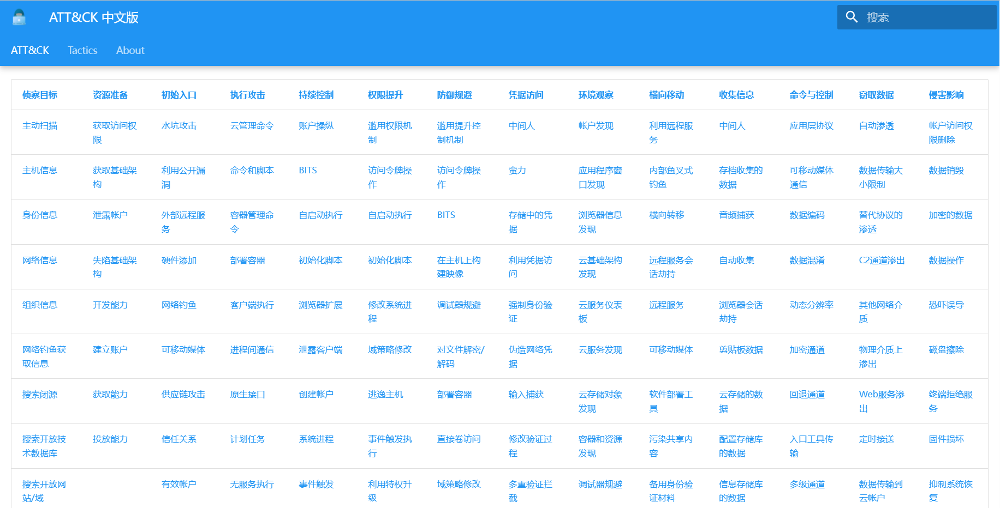
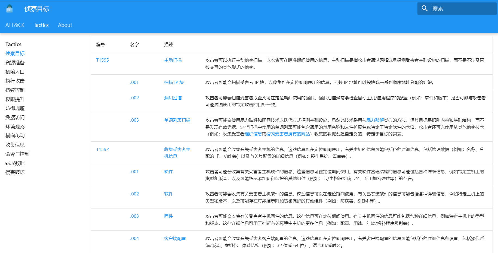

# Attack_CN

**感谢您对 Mitre ATT&CK 中文版的兴趣。**

《ATT&CK 中文版》 为了方便中文读者使用和理解，使读者更容易掌握和运用框架中的知识。

希望可以为中国的网络安全从业人员和安全爱好者提供一个更加便捷和高效的学习工具。

## 演示地址

- Github Page: [https://seccmd.github.io/Attack_CN/](https://seccmd.github.io/Attack_CN/)

## 页面截图

**欢迎安全交流**
- [Github](https://github.com/seccmd/Attack_CN)
- [Twitter](https://twitter.com/sec_cmd)
- [Blog](https://www.seccmd.net/)
